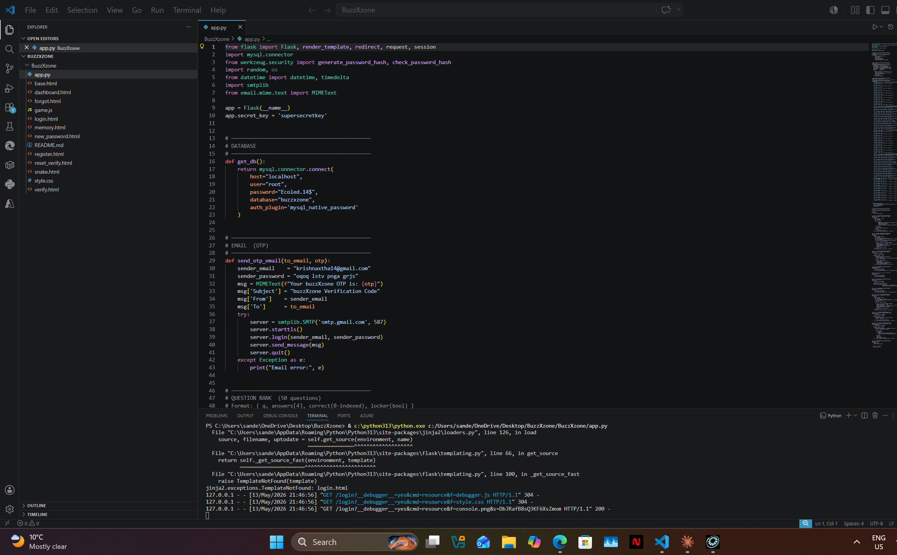

# Week 1 — Evidence

## Screenshots

### Flask Database Setup

Initial Flask application database initialisation — the `init_db()` function creating
the `users` table and auto-migrating the schema.

---

### Roles Assigned

Team roles and responsibilities assigned at the start of Week 1. Each member's Trello
card reflects their assigned area: Developer, Designer, Tester, Project Manager, etc.

---

## Summary of Evidence

| Screenshot | What It Shows |
|------------|---------------|
| `FLASK_DB_SETUP.png` | Database initialisation function in `app.py` |
| `Roles assigned.png` | Team role assignment cards on Trello |
