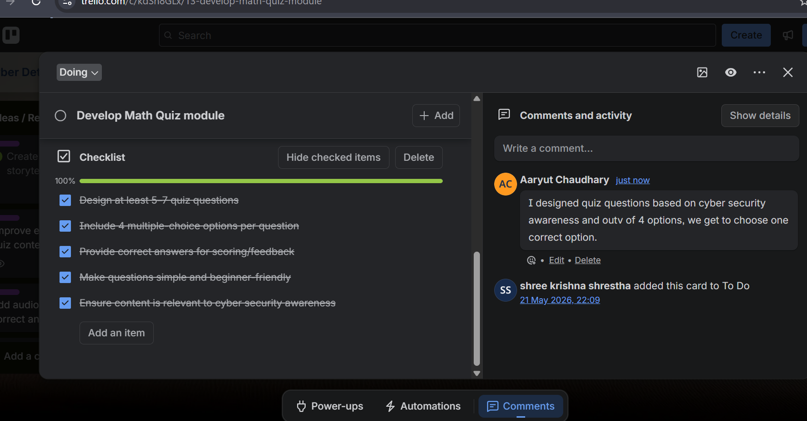
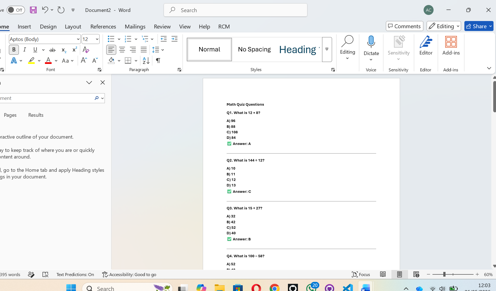
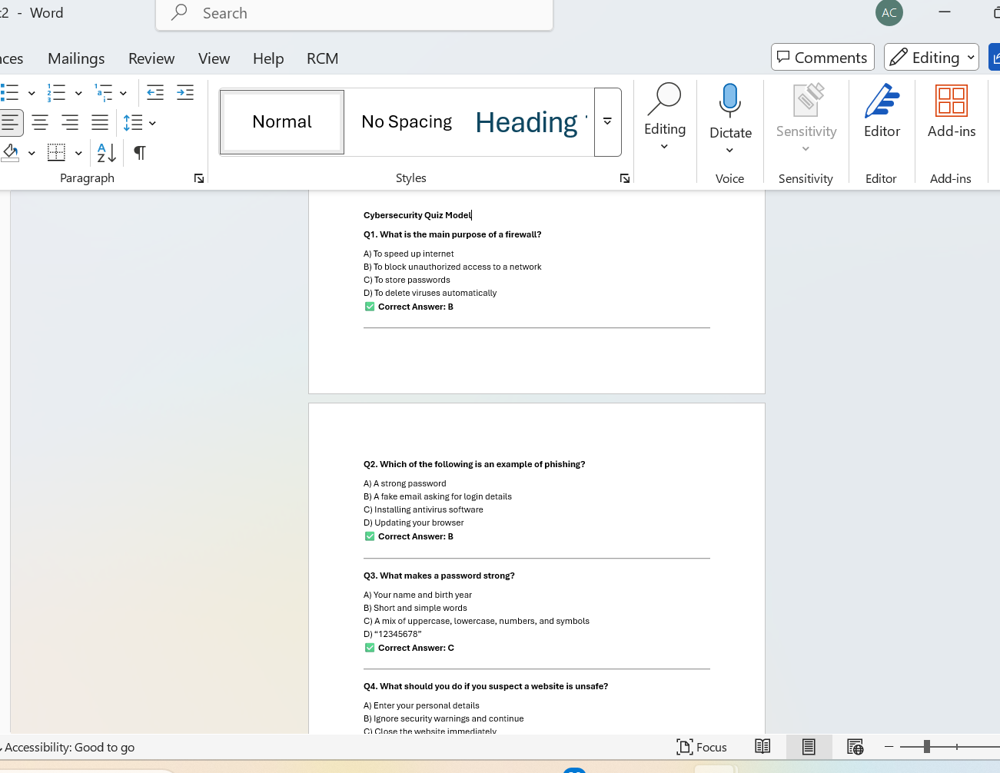
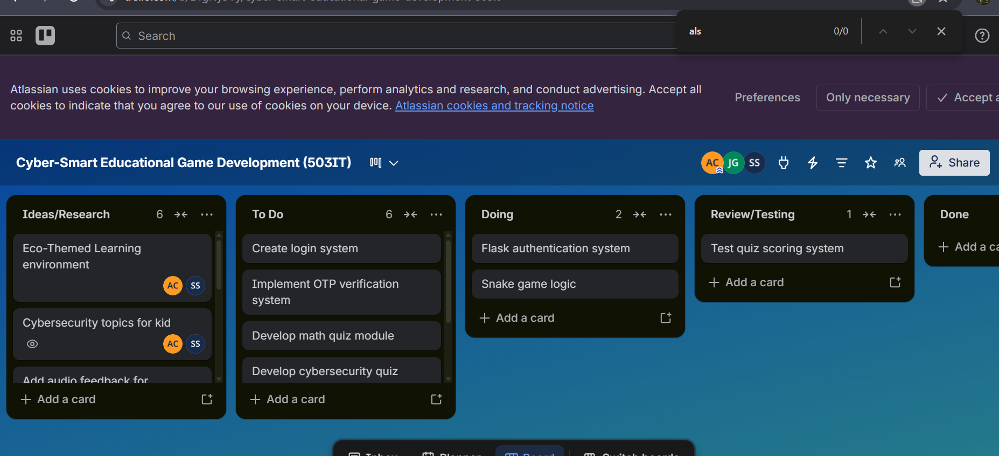
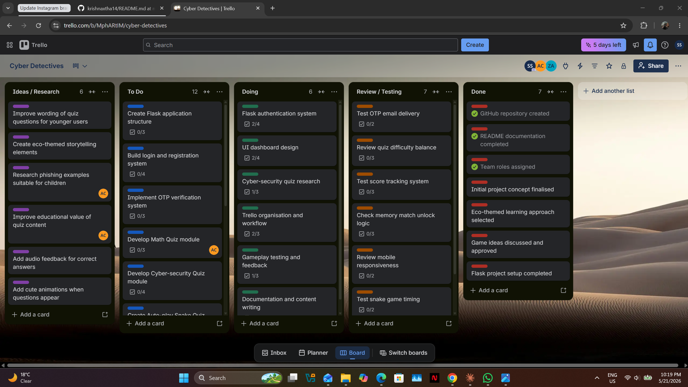

# Week 2 — Evidence

## Screenshots

### Math Quiz Interface

The Math Quiz difficulty selector and question screen, showing the timer bar, answer buttons,
and score counter.

---

### Question Bank — Maths

The `math_easy.json` question bank open in the editor, showing the JSON structure with
questions, four answer choices, correct index, and worked-solution hints.

---

### Question Bank — Cyber Security

The `cyber_easy.json` question bank, showing cybersecurity questions in the same JSON format.

---

### Trello Board — Sprint 2 (View 1)

Trello board showing tasks assigned to team members for Sprint 2, with cards in the
To Do, In Progress, and Done columns.

---

### Trello Board — Sprint 2 (View 2)

Trello board showing completed quiz development and testing cards being moved to Done.

---

## Summary of Evidence

| Screenshot | What It Shows |
|------------|---------------|
| `MATH_QUIZ.png` | Math Quiz interface with timer and answer buttons |
| `QN_Bank_Maths.png` | Math question bank JSON structure |
| `QN_Bank_Cyber.png` | Cyber question bank JSON structure |
| `Trello_Board_01.png` | Sprint 2 task board (initial view) |
| `Trello_Board_02.png` | Sprint 2 task board (progress view) |
