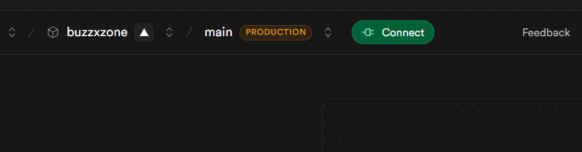
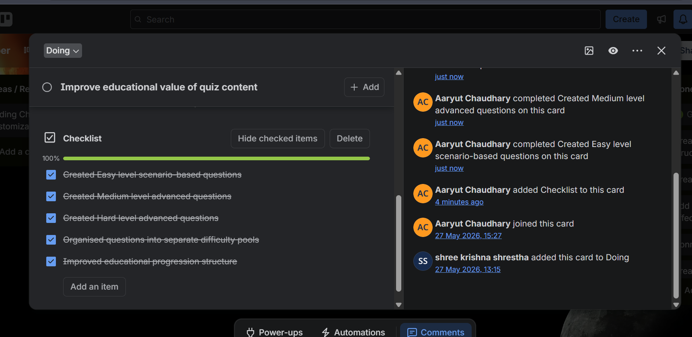

# Week 3 — Evidence

## Screenshots

### Supabase Database

The Supabase dashboard showing the `users` table connected to the buzzXzone application.
The table includes all required columns: `id`, `username`, `email`, `password`,
`high_score`, and `memory_unlocked`.

---

### Updated Question Banks

The updated question banks showing revised and expanded questions across multiple
difficulty levels for both Math and Cyber Security quiz categories.

---

## Summary of Evidence

| Screenshot | What It Shows |
|------------|---------------|
| `Supabase_db.png` | Supabase PostgreSQL `users` table structure and connection |
| `Updated_QN_QUIZ.png` | Revised and expanded question banks across all difficulty levels |
