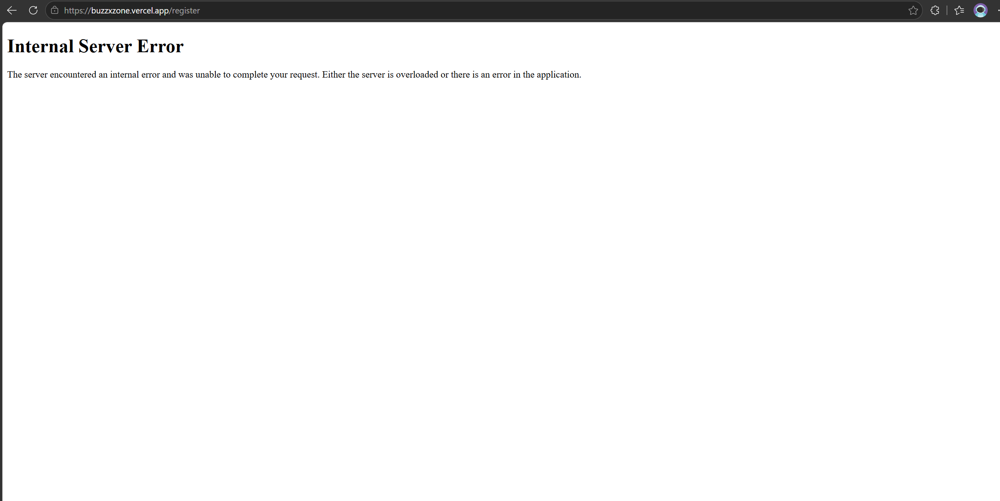
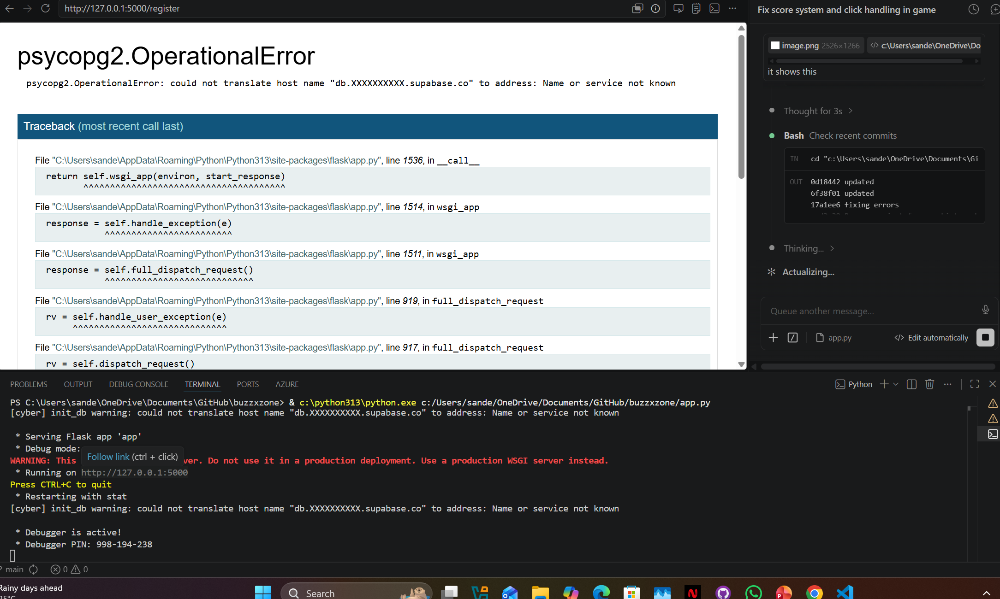
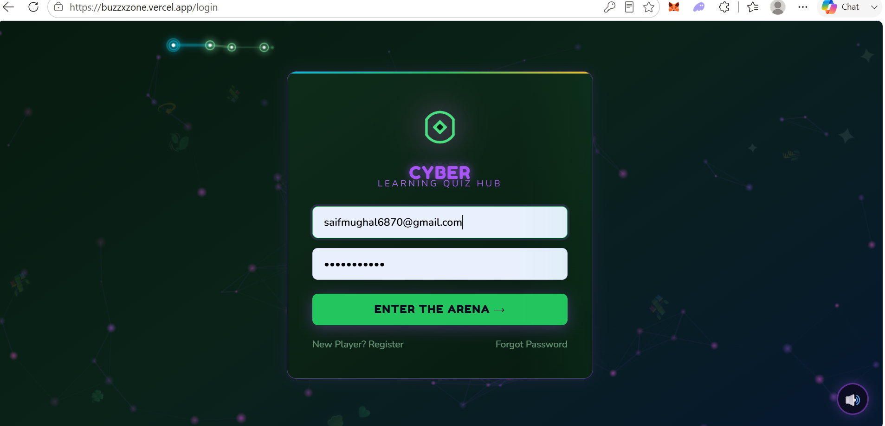
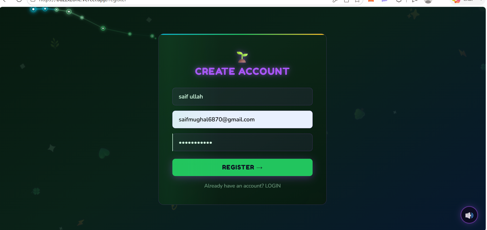
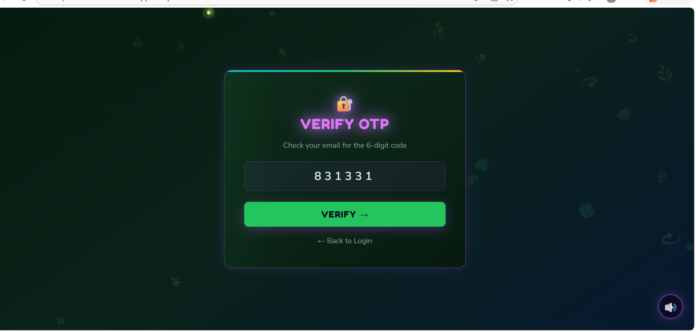
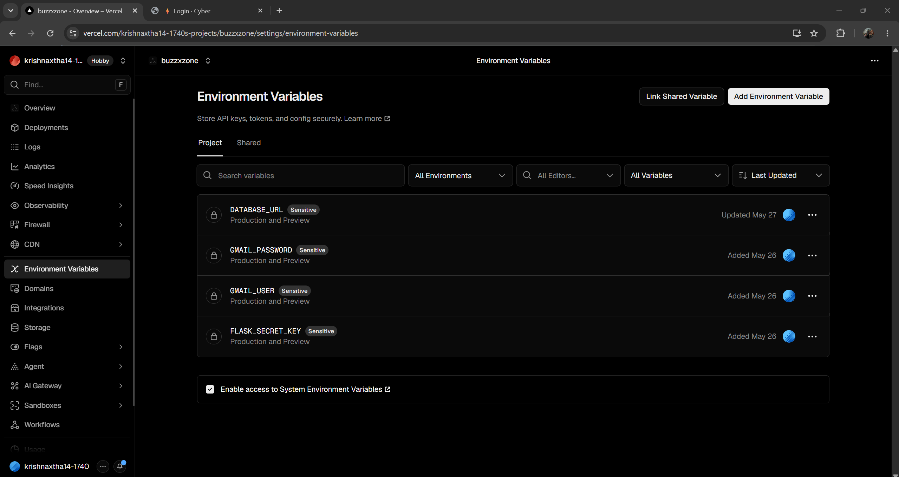
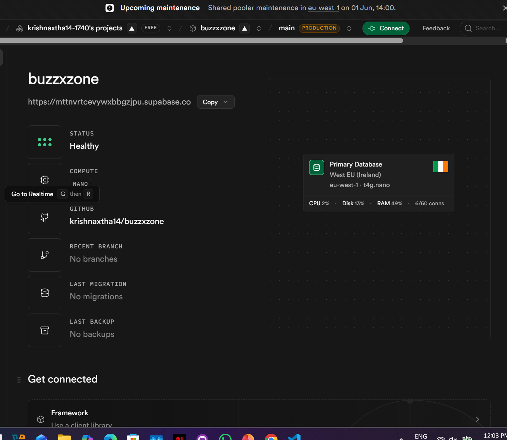
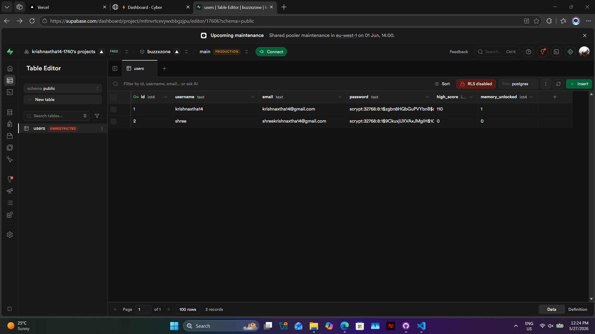
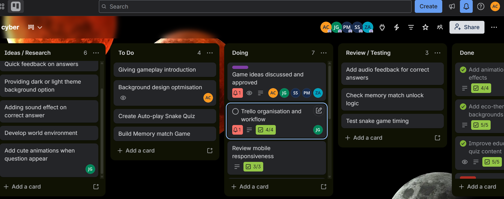

# Week 4 — Evidence

## Screenshots

### Internal Error — Fixed

An internal server error encountered during deployment was diagnosed and resolved.
The fix involved correcting the database connection path for the Vercel environment.

---

### psycopg2 Operational Error — Fixed

A `psycopg2.OperationalError` encountered when connecting to the Supabase database
was resolved by updating the connection string to include `sslmode=require` and
switching to the transaction pooler port (6543).

---

### Login Interface

The completed login page in the live Vercel deployment — showing the eco-forest theme,
form validation, and OTP flow entry point.

---

### Register Interface

The completed registration page — showing the username, email, and password fields
with the eco-themed card layout.

---

### OTP Verification

The OTP verification page showing the 6-digit code input field, styled with the
eco-forest theme. Tested successfully in the production environment.

---

### Vercel Environmental Setup

The Vercel dashboard showing all required environment variables configured:
`DATABASE_URL`, `FLASK_SECRET_KEY`, `GMAIL_USER`, and `GMAIL_PASSWORD`.

---

### Vercel Status — Online & Healthy

The Vercel deployment dashboard showing the app as online with a successful build.
The `/health` endpoint confirms `{"status": "ok", "database": "connected"}`.

---

### Vercel User Credentials Config

The Vercel project settings showing user-level environment variables correctly
scoped to production.

---

### Trello Board — Final

The Trello board at final submission showing all tasks completed with descriptions
and evidence attached across all team members' cards.

---

## Summary of Evidence

| Screenshot | What It Shows |
|------------|---------------|
| `Internal_ERROR_FIXED.png` | Server error resolved — deployment fix |
| `psycopg2.operationalERROR_FIXED.png` | Supabase SSL connection error resolved |
| `Login_interface.png` | Live login page with eco-forest theme |
| `Register_Interface.png` | Live registration page |
| `Verification.png` | OTP verification page in production |
| `VERCEL_ENVIRONMENTAL_SETUP.png` | All env vars configured in Vercel |
| `VERCEL_STATUS_ONLINE_HEALTHY.png` | Deployment live and healthy |
| `VERCEL_USER_CREDENTIALS.png` | Vercel credentials configuration |
| `Trello_Board.png` | Final Trello board — all tasks completed |
